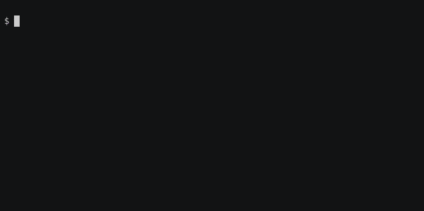

# Building your first container

In this simple example we will build Singularity container that will run the following programs `fortune | cowsay | lolcat` by installing all necessary libraries and packages within Ubuntu 16.04 Linux distribution setup.

## Simple Singularity definition file

!!! note "lolcow.def"
    ``` singularity
    BootStrap: docker
    From: ubuntu:16.04

    %post
      apt-get -y update
      apt-get -y install fortune cowsay lolcat

    %environment
      export LC_ALL=C
      export PATH=/usr/games:$PATH

    %runscript
      fortune | cowsay | lolcat
    ```

## Building the container

``` bash
$ sudo singularity build lolcow.sif lolcow.def

Starting build...
Getting image source signatures
Copying blob 4007a89234b4 done  
Copying blob 5dfa26c6b9c9 done  
Copying blob 0ba7bf18aa40 done  
Copying blob 4c6ec688ebe3 done  
Copying config 24336f603e done  
Writing manifest to image destination
Storing signatures

...

INFO:    Adding environment to container
INFO:    Adding runscript
INFO:    Creating SIF file...
INFO:    Build complete: lolcow.sif
```

## Run the Singularity container

```
$ ./lolcow.sif 
_________________________________________
/ You will stop at nothing to reach your  \
| objective, but only because your brakes |
\ are defective.                          /
 -----------------------------------------
        \   ^__^
         \  (oo)\_______
            (__)\       )\/\
                ||----w |
                ||     ||

```
**-=>>> Done <<<=-**

 [asciinema](https://asciinema.org/a/469408)


## Syntax of the definition file

!!! note "lolcow.def"
    ``` singularity linenums="1"
    BootStrap: docker
    From: ubuntu:16.04

    %post
      apt-get -y update
      apt-get -y install fortune cowsay lolcat

    %environment
      export LC_ALL=C
      export PATH=/usr/games:$PATH

    %runscript
      fortune | cowsay | lolcat
    ```

### _header_: Bootsrap agents - [online documentation](https://sylabs.io/guides/latest/user-guide/definition_files.html#preferred-bootstrap-agents)
- `library` - images hosted on the [Container Library](https://cloud.sylabs.io/library)
- `docker` - images hosted on [Docker Hub](https://hub.docker.com/)
- `shub` - images hosted on [Singularity Hub](https://singularityhub.com/)
- ...
- Other: `localimage`, `yum`, `debootstrap`, `oci`, `oci-archive`, `docker-daemon`, `docker-archive`, `arch`, `busybox`, `zypper`

### _header_: From
Depending on the value assigned to `Bootstrap`, other keywords may also be valid in the header. For example, when using the `library` bootstrap agent, the `From` keyword becomes valid.

### %post
This section is where you can download files from the Internet, install new software and libraries, write configuration files, create new directories, etc.

### %environment
The `%environment` section allows you to define environment variables that will be set at runtime.

### %runscript
The contents of the `%runscript` section are written to a file within the container that is executed when the container image is run (either via the `singularity run` command or by executing the container directly as a command)

### Brief summary with examples - [online documentation](https://sylabs.io/guides/latest/user-guide/cli/singularity_build.html?highlight=sandbox#examples)

### All sections - [online documentation](https://sylabs.io/guides/latest/user-guide/definition_files.html#sections)


## Installing software from a local package
Sometimes, you cannot download a package directly or the software needs signing licenses. In this case you need to push in the locally downloaded file during the build process. You can get the latest version of the file bellow from here: https://jp-minerals.org/vesta/en/download.html (_download the the linux `VESTA-gtk3.tar.bz2` version_).

!!! note "vesta.def"
    ``` singularity
    Bootstrap:  docker
    From: ubuntu:20.04
    
    %files
      VESTA-gtk3.tar.bz2 / 

    %post
      export DEBIAN_FRONTEND=noninteractive
    
      apt-get update && apt-get -y dist-upgrade && \
      apt-get install -y libxmu6 libxss1 libxft2 libquadmath0 libpng16-16 bzip2 libgl1-mesa-glx \
      libglu1-mesa libglib2.0-0 libgtk-3-0 libgtk-3-dev libgomp1 && \
      apt-get clean
      
      # Install/unpack the precompiled software
      tar -C /usr/local -xvf /VESTA-gtk3.tar.bz2 && rm /VESTA-gtk3.tar.bz2   

    %runscript
      /usr/local/VESTA-gtk3/VESTA "$@"
    ```

Note the `%files` section. The line bellow will copy
`VESTA-gtk3.tar.bz2` from the current directory to the root folder 
`\ ` in the Singularity container. Also, you need to figure out yourself all required libraries and dependencies and install them.
