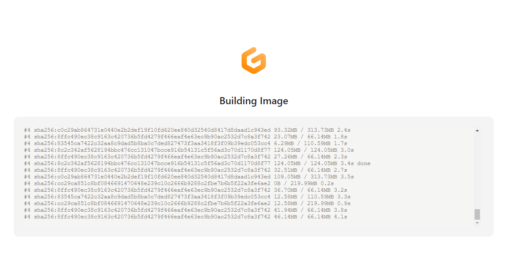
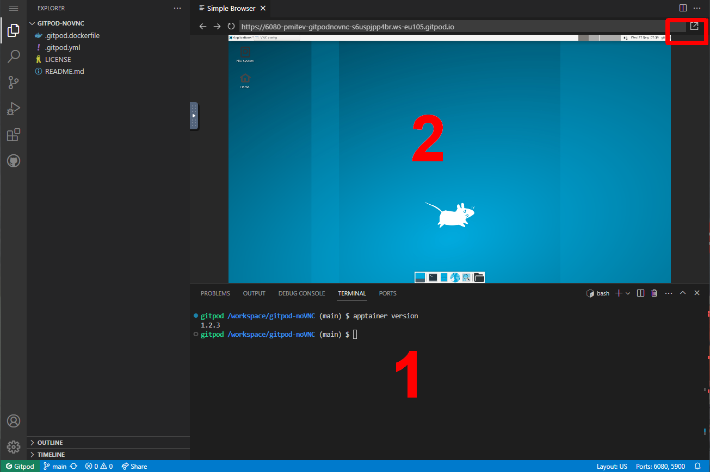

# Building Apptainer containers interactivelly on Gitpod.

There is an **experimental build** with graphical interface and Apptainer running in [Gitpod](https://www.gitpod.io/).  
The free tier allows users to run about 50 hours on the standard configuration (4 cores, 8GB RAM, ~30GB storage).  

[](https://gitpod.io/#https://github.com/pmitev/gitpod-noVNC)

To start the session, click on the button above, follow the instructions to link your GitHub/GitLab etc. account, wait for the build and start the session.

---

1. Select the default options for the "New Workspace"

2. Click on "Continue" and wait for the build - this might take some 10-15 minutes.
 
3. The Workspace will open VScode interface with a preview of the graphical interface (2). You can use the terminal (1) to build in text or click in the top right corner to open the graphical interface in a separate tab in the browser.

If you close the Workspace by accident,    again on the button above, go to [https://gitpod.io/workspaces](https://gitpod.io/workspaces) and open the already build workspace.  
If you have closed by accident the graphical interface, from console (1) run 
```bash
gp preview --external $(gp url 6080)
```
Copy/paste from your computer to the graphical interface is a bit cumbersome

so, perhaps it is better to open Chrome from the "Applications/Internet/Google Chrome" menu and copy paste the material from there.
4. To build a recipe run (you can use `singularity` as well - it will still run `apptainer`)
```bash
sudo apptainer build lolcow.sif lolcow.def
```
5. Run as usually.
