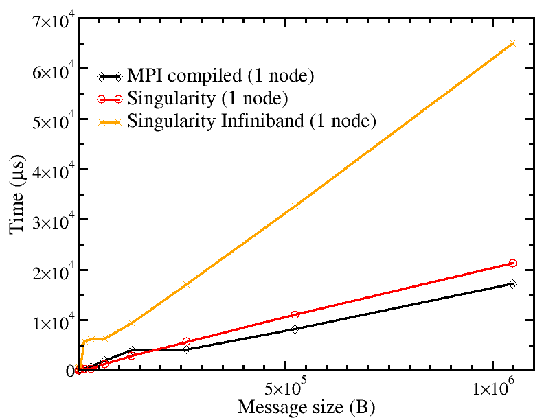

# Singularity MPI ([Kebnekaise](https://www.hpc2n.umu.se/resources/hardware/kebnekaise))

## Setup 

The following definition script (**osu_benchmarks.def**) was used to
generate the Singularity container:

``` singularity
Bootstrap: docker
From: ubuntu:20.04

%files
    /home/pedro/Singularity_MPI/osu-micro-benchmarks-5.8.tgz /root/
    /home/pedro/Singularity_MPI/openmpi-4.0.3.tar.gz /root/

%environment
    export OSU_DIR=/usr/local/osu/libexec/osu-micro-benchmarks/mpi

%post
    apt-get -y update && DEBIAN_FRONTEND=noninteractive apt-get -y install build-essential gfortran openssh-server
    cd /root
    tar zxvf openmpi-4.0.3.tar.gz && cd openmpi-4.0.3
    echo "Configuring and building OpenMPI..."
    ./configure --prefix=/usr && make all install clean
    export PATH=/usr/bin:$PATH
    export LD_LIBRARY_PATH=/usr/lib:$LD_LIBRARY_PATH
    cd /root
    tar zxvf osu-micro-benchmarks-5.8.tgz
    cd osu-micro-benchmarks-5.8/
    echo "Configuring and building OSU Micro-Benchmarks..."
    ./configure --prefix=/usr/local/osu CC=/usr/bin/mpicc CXX=/usr/bin/mpicxx
    make -j2 && make install

%runscript
    echo "Rank - About to run: ${OSU_DIR}/$*"
    exec ${OSU_DIR}/$*
```

This is an adaptation of the example from *The Carpentries*
(https://carpentries-incubator.github.io/singularity-introduction/08-singularity-mpi/index.html).
Generation of the container was done through:

``` bash
sudo singularity build osu_benchmarks.sif osu_benchmarks.def 
```

The container is then transferred to Kebnekaise. Notice that the MPI
versions that will be used in Kebnekaise need to match the ones used
in the generation of the container. Running the container is done 
through the batch system, a typical run for the latency benchmark
case is as follows:

``` slurm
#!/bin/bash
#SBATCH -A Project_ID
#SBATCH -n 2
#SBATCH -t 00:10:00
#SBATCH --exclusive

ml purge  > /dev/null 2>&1
ml singularity/3.8.2
ml GCC/9.3.0
ml OpenMPI/4.0.3

#MPI compiled
mpirun -np 2 /osu-micro-benchmarks/mpi/pt2pt/osu_latency

#Singularity container
mpirun -np 2 singularity run osu_benchmarks.sif pt2pt/osu_latency
```

## Benchmark results

---


Fig.1 - Latency benchmark on Kebnekaise using the on-site MPI-compiled version (black), the singularity container (red) and singularity container compiled with infiniband libraries (orange). There is a 9.6% "overhead" in going from MPI-compiled (black) to singularity (red) for 4MB message.

---


Fig.2 - All-to-all benchmark on Kebnekaise using the on-site MPI-compiled version (black), the singularity container (red), singularity container compiled with infiniband libraries (orange), and Apptainer (blue). There is a 24.2% "overhead" in going from MPI-compiled (black) to singularity (red) for 1MB message.


